# Final Report

## Summary

In this project, we achieved real time simulation and rendering of fire effects in both 2D and 3D. 
Our implementation utilized Unity post processing and HLSL shaders as the programming platform, and we adopted popular techniques in noise generation, physical simulation and volumetric rendering. 
Our 2D fire is implemented with panning Voronoi noise and Perlin noise, while our 3D fire relies on a custom fluid-simulation and ray-marching procedure. 
We measured our rendering effects and performance on an NVIDIA 2060 graphics card and obtained near real-time results.

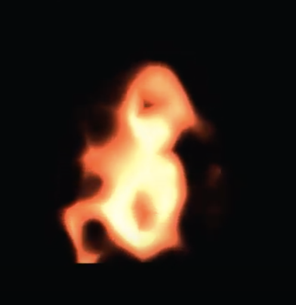
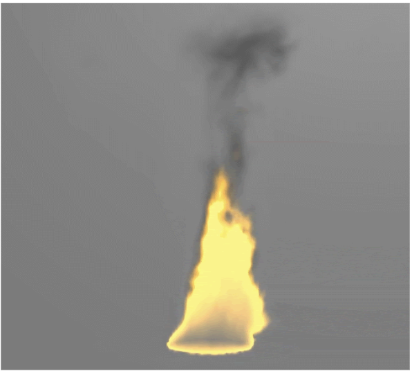
<figcaption align="middle">Snapshots of our fire effects</figcaption>

 

## Technical Approach

### 2D Fire

We multiplied Voronoi noise and Perlin noise textures and interpolated their product with a standard u-v texture. 
We then took Gaussian Blob samples to simulate the features of fire. Lastly, we applied a color gradient to give an orange color to the blob.

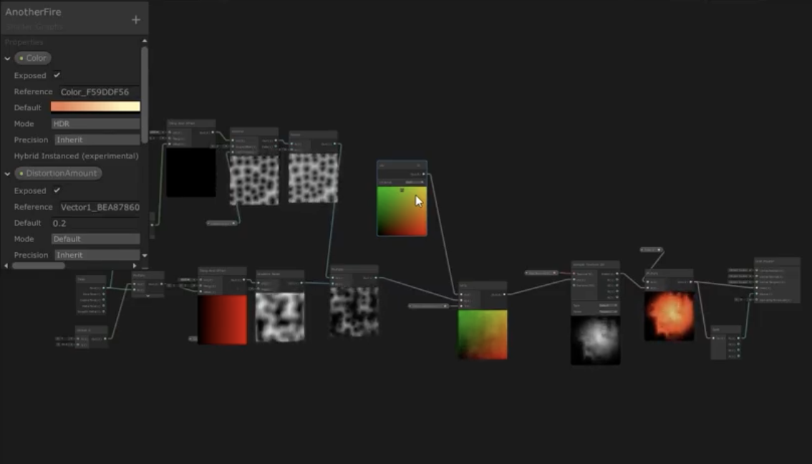
<figcaption align="middle"> Visualization of the simulation and rendering pipeline. </figcaption>

 

### 3D Fire

#### Simulation

We decided to use 3D textures to hold different attributes that describe a fire. In our simulation, we calculated the corresponding values for velocity, smoke density, temperature, and fuel level in each cell of a 3D voxelized grid.

We based our simulation off the Navier Stokes equation for fluid dynamics:

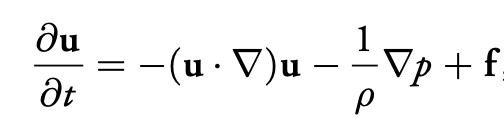
<figcaption align="middle">  </figcaption>

 

In the formula, u is the velocity, p is the pressure, ρ is the density of the molecule mass, and f is the external force on molecules. 
The first term represents the advection, which is the velocity of a fluid that causes the fluid to transport objects, 
densities, and other quantities along with the flow. The term inside the parenthesis is the divergence, which represents the rate at which density exits the region.
The second term simulates how pressure gathers and generates force and provides accelerations to the surrounding molecules. 

For each time step, we compute the advection and divergence based on the interaction between neighboring voxels, 
and propagate the changes in temperature, pressure, and velocity correspondingly. 
We then update the values in each 3D texture and render the resulting volume to the screen with the rendering pipeline. 

For the external force field of the Navier Stokes equation, we simulated both buoyant force and vorticity force using the following equations:

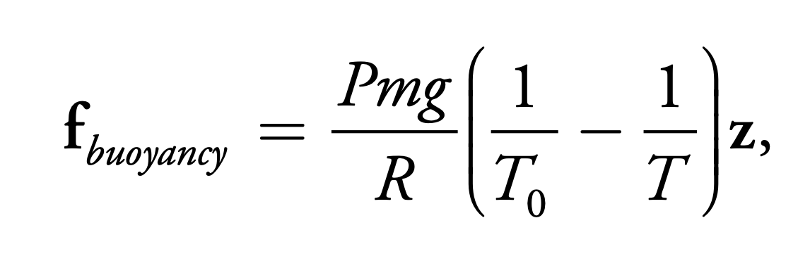
<figcaption align="middle"> Formula for simulating buoyancy</figcaption>

 

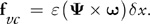
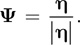
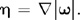
<figcaption align="middle"> Formula for simulating vorticity</figcaption>

  

The buoyant force is influenced by temperature and density, and it changes the velocity of molecules to make the simulation more realistic. With a higher temperature, the molecules will rise with a larger velocity. 
The other force that we applied to our molecules is vorticity force. This force helps us restore some of the curling behavior of smoke that was lost due to the discrete nature of the simulation.

Below is the simulation pipeline that we used. It outputs the values in 3D Textures encoding.

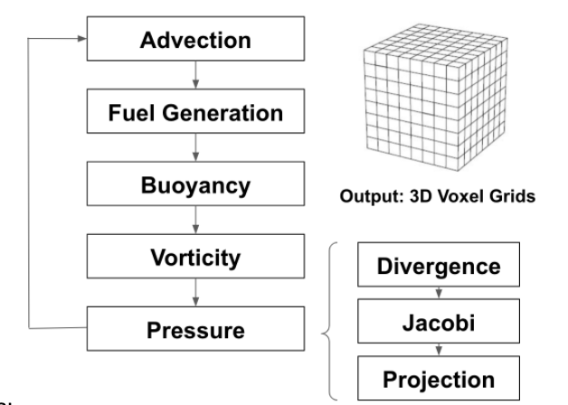
<figcaption align="middle"> Simulation Pipeline</figcaption>

  
#### Rendering

After implementing the simulation part, we gave the fire some orange color and rendered the result using HLSL render shader in Unity, 
injected into the pipeline via post processing. 
Instead of using ray-tracing technique mentioned in class, we used ray-marching technique to realize the effect that rays advance with time steps and restored the effect of rays meeting particles with different densities in further arithmetic calculation.
The volumetric ray-marching shader takes in the 
Below is a schematic graph for Ray-Marching. 
It takes in the 3D Voxel Grids generated by the simulation stage and renders Smoke Density and Reaction coordinate to the screen

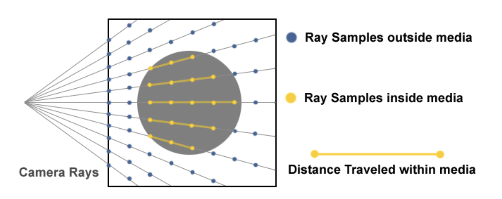
<figcaption align="middle">Ray marching for volumetric Rendering</figcaption>

  
Our fire consists of three components: a solid core, a bright border, and some smoke. 
For the smoke, we’ve used the Beer’s Law to create the exponential drop off effect, in-scattering to create the dark edges, and the Henyey-Greenstein Phase Function to create the silver lining.

#### Special Effects

In order to make the fire appear more realistic, we also added an additional ember effect to the top of the flames.
Ember effect are distinct spurts of burning particles that are cause by incompletely combusted fuel that are advected
into the air. This special effect is integrated into our physical model by simulating a additional Voxel space of ember
particles that are randomly generated at the bottom of the fire with Perlin noise and propelled upwards through advection.
Our raymarching procedure detects these particles and add a small glowing aura around them to make them appear realistic.

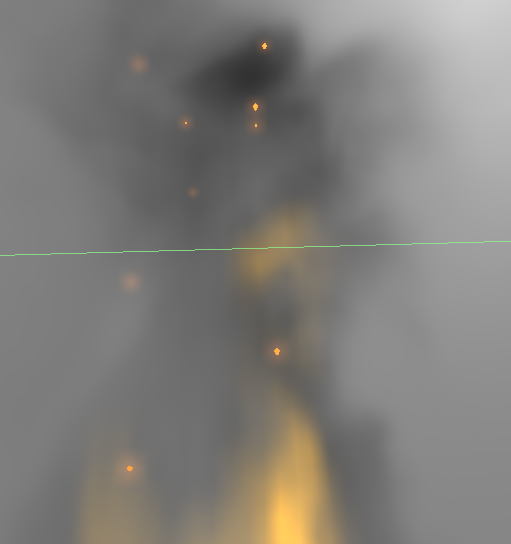
<figcaption align="middle"> Ember effect of our rendered fire</figcaption>

## Results

We experimented our simulation and rendering procedure on an NVIDIA RTX 2060 graphics card and achieved near real-time
(60+ fps) results. We set our voxel grid size to 128\*128\*128. For our GPU kernels, we used 
16\*16\*16 GPU blocks, each containing 512 threads.  

For a view of our full simulation and rendering results, we have put together a demo video below:

TODO: VIDEO HERE

LINK: 

## Problems & Lessons Learned
The main difficulty of our implementation came from debugging the propagation of the attributes across timestamps. Unity is not designed to accommodate print debugging so we created a script in Python to calculate the values for a 2D fire simulation. It turned out that the values propagated as expected, which proved that our formula was correctly implemented. We then created a debugging shader, which fills in empty textures when the value that we are testing passes a certain threshold. With the debugging shader, we could easily visualize how the values advanced in our model. 

Some static numerical values cannot be assigned in computing kernels directly. For example, our time step value remained to be zero when we tried to assign it to be a non-zero value in our computing kernel and stopped other values from propagating when time advances. The values of velocity and pressure remained to be zero for a long time and we didn’t know why. We found this bug with our debugging shader. We then explicitly declared these numerical values inside the C# driver file and passed into the computing kernels. 

## References
For the coding part, we referred to the 2D smoke simulation pipeline in this student project (https://rachelbhadra.github.io/smoke_simulator/index.html), the 2D fire documentation in this NVIDIA tutorial (https://developer.download.nvidia.com/books/HTML/gpugems/gpugems_ch38.html), and the 3D molecule simulation architecture in this textbook (https://www.cs.cmu.edu/~kmcrane/Projects/GPUFluid/paper.pdf). None of these references provided 3D fire simulation code. We used 2D architecture as our code framework and raised the dimension of our textures to 3D. We also translated all the formulas needed into Unity kernels and implemented a driver processor to connect the physical simulation with the rendering process. 

Addtional References:

1. “Understanding Perlin Noise” adrian's soapbox， https://flafla2.github.io/2014/08/09/perlinnoise.html 
2. “Real-Time Simulation and Rendering of 3D Fluids”, Keenan Crane, Ignacio Llamas, Sarah Tariq
https://www.cs.cmu.edu/~kmcrane/Projects/GPUFluid/paper.pdf  
3. “GPU Gems - Chapter 38. Fast Fluid Dynamics Simulation on the GPU”, Mark J. Harris,
University of North Carolina at Chapel Hill, https://developer.download.nvidia.com/books/HTML/gpugems/gpugems_ch38.html
4. “Smoke Simulator”, Rachel Bhadra, Jonathan Ngan, Kenneth Tsai, https://rachelbhadra.github.io/smoke_simulator/index.html
5. “Creating a Volumetric Ray Marcher”, Ryan Bruckshttps://shaderbits.com/blog/creating-volumetric-ray-marcher 
6. “Raymarching Workshop Course Outline”, Electric Square https://github.com/electricsquare/raymarching-workshop
7. “Fluids-2D”, Mattias Harrysson, https://github.com/mharrys/fluids-2d Fluids-2D, by Mattias Harrysson
8. “GPU-GEMS-3D-Fluid-Simulation”, Justin Scrawk
https://github.com/Scrawk/GPU-GEMS-3D-Fluid-Simulation

# Contributions
*Ziyao Zhang*: Created rendering pipeline and ray-marching engine for volumetric rendering, made presentation videos

*Eric Ge*: worked on 2D fire, HLSL shaders, simulation kernels and special effects.

*Debbie Liang*: helped implement the simulation process, wrote documentations 

