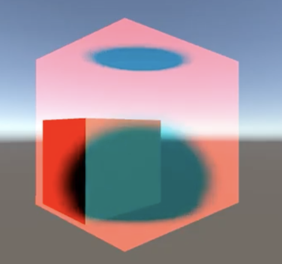

# Milestone

## Accomplishment 
 
### Noise-based 2D Fire
We used multiple Perlin noise textures and interpolated their product with a standard u-v texture. We then took Gaussian Blob samples to simulate the features of fire. Lastly, we applied a color gradient to give an orange color to the blob.
<!-- 

  <table style="width=100%">
    <tr>
      <td>
        
        <figcaption align="middle">Rendering Result</figcaption>
      </td>
      <td>
        
        <figcaption align="middle">Visualization of the simulation and rendering pipeline. </figcaption>
      </td>    
  </table>

 -->

<figcaption align="middle">  </figcaption>

 

<figcaption align="middle">  </figcaption>

 

### Voxel-based 3D fire

We decided to use 3D textures to hold our different attributes that describe a fire. In our simulation, we calculated the corresponding values for velocity, pressure, and temperature for voxels of fire molecules.

Here is the formula that we used: 

<figcaption align="middle">  </figcaption>

 

In the formula, u is the velocity, p is the pressure, ρ is the density of the molecule mass, and f is the external force on molecules. The first term represents the advection, which is the velocity of a fluid that causes the fluid to transport objects, densities, and other quantities along with the flow. The term inside the parenthesis is the divergence, which represents the rate at which density exits the region.  
The second term simulates how pressure gathers and generates force and provide accelerations to the surrounding molecules.  
When time advanced, we computed the advection and divergence based. Based on the interaction between neighboring molecules, we propagated the changes in temperature, pressure, and velocity correspondingly. We then updated the values in each 3D texture and rendered the resulting molecules to the screen with Unity.  

  <table style="width=100%">
    <tr>
      <td>
        
        <figcaption align="middle">The green color represents the propogation of velocity.</figcaption>
      </td>    
  </table>

## Challenges

The main difficulty of our implementation came from debugging the propagation of the attributes across timestamps. Unity is not designed to accommodate print debugging so we created a script in Python to calculate the values for a 2D fire simulation. It turned out that the values propagated as expected, which proved that our formula was correctly implemented. We then created a debugging shader to fill in empty textures so that we could see how the values advanced in our model. 

## Future Goals 

In the next stage, we would like to introduce the buoyant force, an attribute used in the simulation of smoke and fire. The buoyant force is influenced by temperature and density, and it changes the velocity of molecules to make the simulation more realistic. 
We also expect to generate a GIF or a real-time application to render the simulations and incorporate some environmental objects in our rendering. 

## Presentation Slides Link

https://docs.google.com/presentation/d/1p8Mq5FJ8h6zP2ontchP7ci2boV2jzp6p15G_GkCUlQo/edit?usp=sharing

## Video Link 
https://www.youtube.com/watch?v=jdkjiDlUR0A&feature=youtu.be 

## Resources and References

1. “Real-Time Simulation and Rendering of 3D Fluids”, Keenan Crane, Ignacio Llamas, Sarah Tariq
https://www.cs.cmu.edu/~kmcrane/Projects/GPUFluid/paper.pdf  
2. “GPU Gems - Chapter 38. Fast Fluid Dynamics Simulation on the GPU”, Mark J. Harris,
University of North Carolina at Chapel Hill, https://developer.download.nvidia.com/books/HTML/gpugems/gpugems_ch38.html
3. “Smoke Simulator”, Rachel Bhadra, Jonathan Ngan, Kenneth Tsai, https://rachelbhadra.github.io/smoke_simulator/index.html

